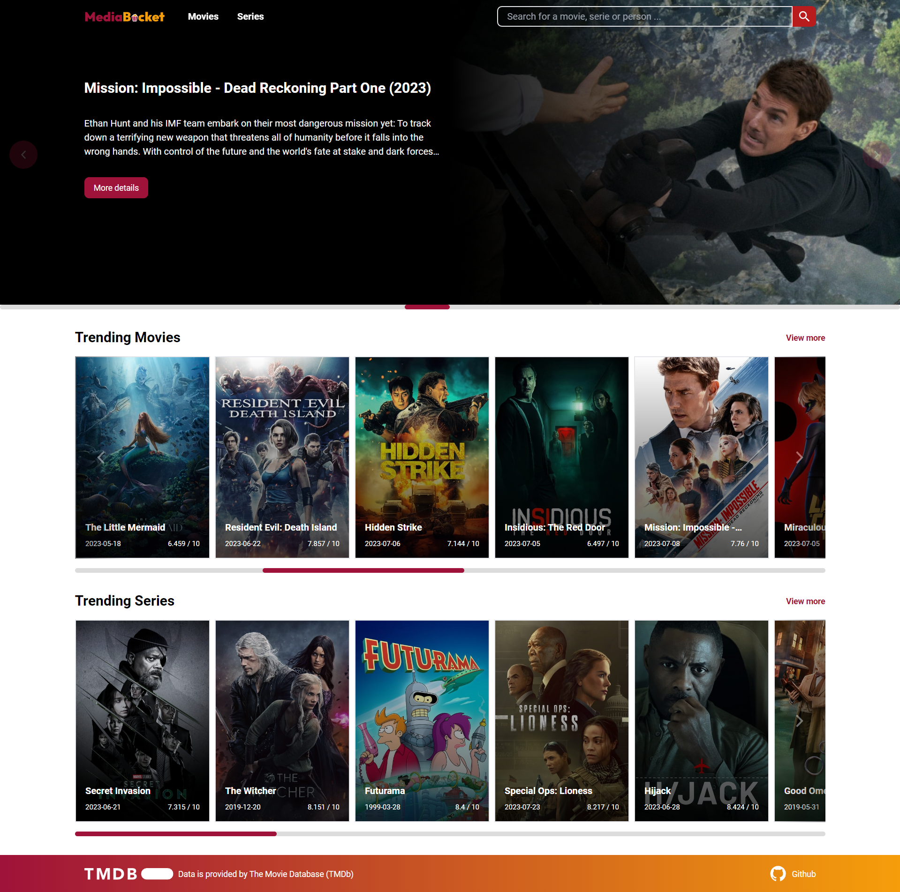
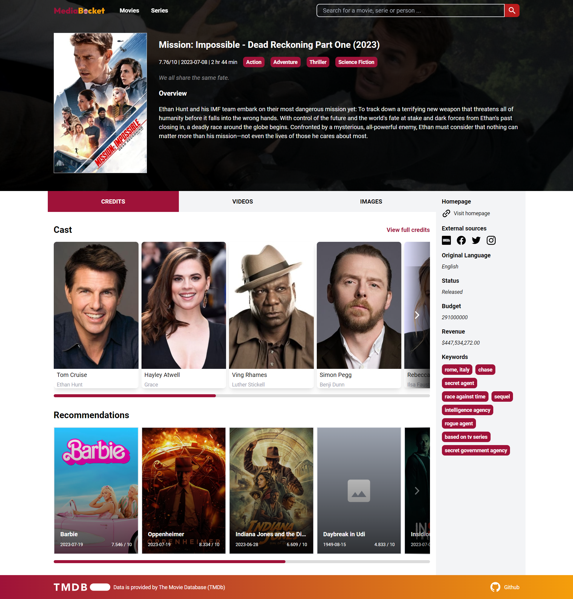
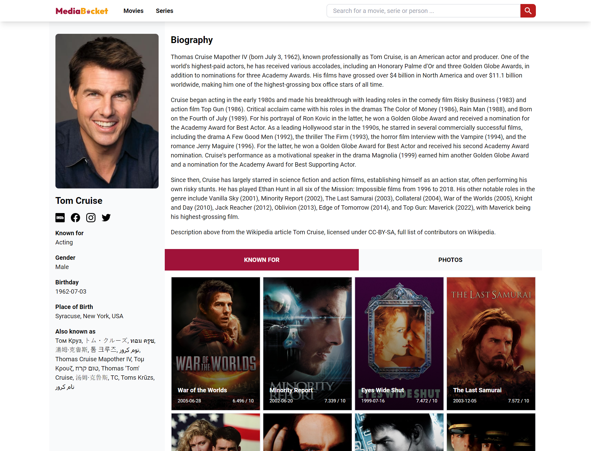

 
 

---

 

>  Web application for browsing movies, series and people in the film industry.

Built by using [Vue.js (Vue 3)](https://vuejs.org/) , [TypeScript](https://www.typescriptlang.org/)  and [TailwindCSS ](https://tailwindcss.com/) 

Live Demo: https://mediabucket.vercel.app

 

# Screenshots

 

 

